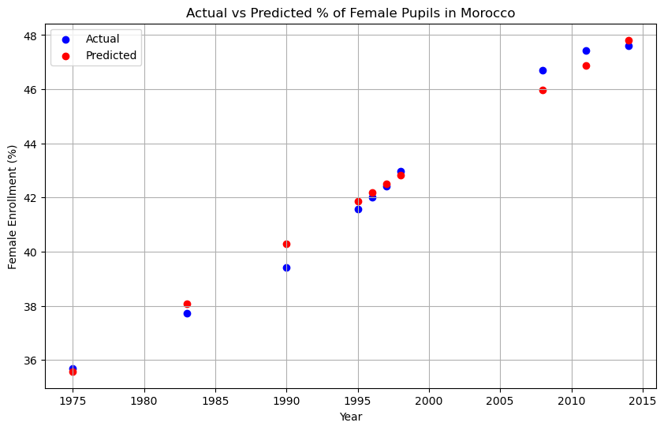
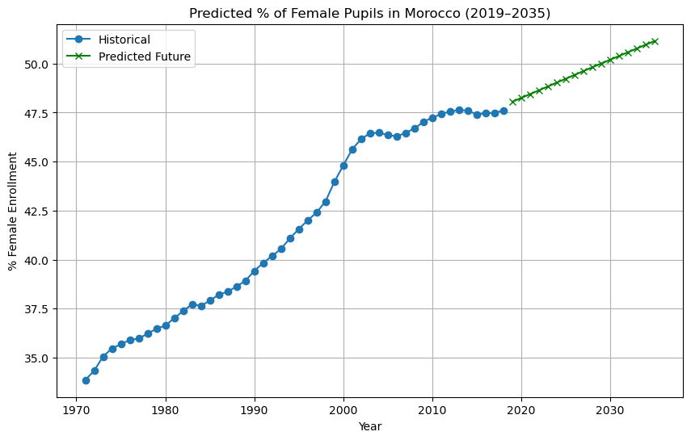

# 🎓 Predicting the Future of Girls’ Education in Morocco with AI 🇲🇦

This project applies **artificial intelligence** to analyze and forecast the percentage of **female pupils enrolled in primary education in Morocco**, using historical data provided by the **World Bank**.

A neural network built with **TensorFlow** was trained on data from **1971 to 2020**, allowing the model to learn long-term enrollment trends and **predict future values up to 2035**.

---

##  Why This Matters

Gender equality in education is a cornerstone of social and economic progress. By using AI to forecast trends in female school enrollment, this project supports data-driven education planning and advocacy efforts — especially in countries like Morocco where bridging gender gaps remains a development priority.

---

## What I Built

- Trained a **feedforward neural network** using Keras (3 layers: 16-8-1 units)
- Used **MinMaxScaler** for data normalization
- Applied **train/test split** for validation
- Generated visualizations of both:
  - Actual vs predicted historical data
  - Forecasts from 2020 through 2035

---

##  Visual Results

### Actual vs Predicted (Test Data)
 

### Forecast (2020–2035)

---

## Tech Stack

- **Python**
- **TensorFlow / Keras**
- **pandas · numpy · matplotlib**
- **scikit-learn** for preprocessing

---

## Key Results

- Strong agreement between predicted and actual values
-  Visual confirmation of rising trend in female education access
- Successful forecast for next decade (2025–2035)

---

## 📂 Dataset

- **Source:** [World Bank – Primary education, pupils (% female)](https://data.worldbank.org/indicator/SE.PRM.ENRL.FE.ZS)
- **Country:** Morocco 🇲🇦
- **Years Covered:** 1971–2020

---

## 👨‍💻 Author

**Nourelhaqe**  
AI Practitioner | Computational Sciences | Education Innovator  
adanie94@asu.edu

---

## 📘 Citation

If you use this project or its findings in your work, please cite:

> El macouti Nour el haq. (2025). *AI-Powered Forecasting of Female Education Trends in Morocco* (v1.0.0) . Zenodo. https://doi.org/10.5281/zenodo.15391382

